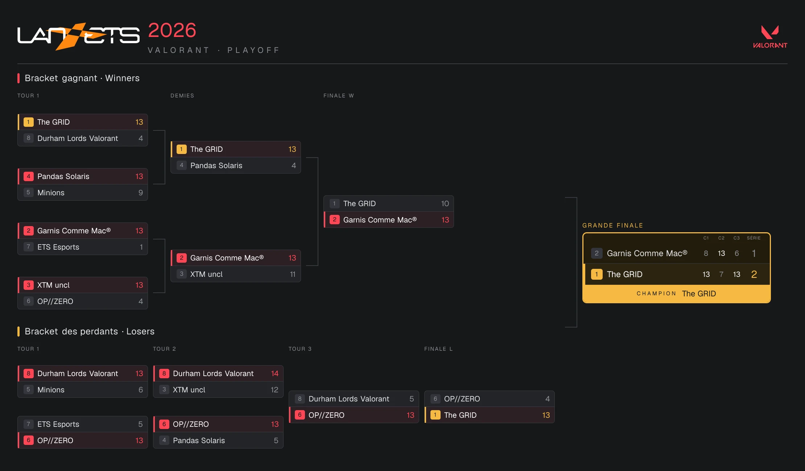

# Système de tournoi — LAN ÉTS 2026

> ## 🏆 Archive — un souvenir
>
> Petit système de tournoi **_vibe-codé_ pour le plaisir**, en vue du **LAN ÉTS
> 2026**. Il a fait le travail le jour J : le tournoi **Valorant** s'est bien
> déroulé, les équipes étaient contentes, et **The GRID** est repartie championne.
>
> Ce dépôt est **archivé comme souvenir**, pas comme un produit. Tout a été pensé
> *spécifiquement* pour le LAN ÉTS 2026 (formats, horaire, identité visuelle,
> intégrations) — c'est rejouable depuis zéro (voir plus bas), mais ce n'est pas
> un logiciel générique conçu pour vivre hors de ce contexte. Et c'est très bien
> comme ça. 🙂
>
> ### 👉 [Voir les résultats du tournoi](docs/RESULTS.md) — 🥇 Champion : **The GRID**

[](docs/RESULTS.md)

---

Application web légère, destinée aux **organisateurs**, pour gérer le tournoi
**Valorant** du LAN ÉTS 2026. Les scores sont saisis manuellement par l'orga ;
l'app sert aussi à afficher les brackets et classements sur un projecteur, et à
générer des messages Discord copier/coller.

> **But d'origine** : un outil basique mais réellement utile le jour de
> l'événement. Pas de sur-ingénierie.

## État du projet

Application qui a tourné **de bout en bout** pour Valorant (suisse → playoff).
Inclus : import du
roster depuis un fichier `.xlsx`, gestion complète des équipes/rosters, saisie des
scores, vue projecteur, image de bracket générée en direct, panneau Discord, et un
**serveur MCP** (`mcp/server.ts`) qui a permis de piloter le tournoi via Claude. La
couche logique pure est entièrement testée (`tsc` strict ; `next build` comme
garde-fou de l'UI).

## Format du tournoi

| Phase | Format |
|---|---|
| **Phase 1** | Suisse « jusqu'à 3 V / 3 D » (anti-revanche, Buchholz, byes) |
| **Phase 2** | Playoff double élimination (top 8 configurable) |

## Architecture

Toute la logique vit dans `lib/`, en TypeScript pur, sans dépendance au framework
UI. Les fonctions sont **pures et immuables** (elles retournent un nouvel état),
ce qui les rend faciles à tester.

```
lib/
├── domain/types.ts          Types partagés (Participant, Standing…)
├── formats/
│   ├── swiss.ts             Phase suisse (phase 1)
│   ├── double-elimination.ts Playoff double élimination (phase 2)
│   └── …                    Autres moteurs de format, jamais utilisés à l'événement
├── discord/
│   ├── split.ts             Découpe à la limite Discord (2000 car.)
│   └── format.ts            Messages copier/coller (appariements, classement…)
├── schedule/estimate.ts     Estimation d'horaire (postes, pauses, jour suivant)
└── runtime/runner.ts        Orchestration du tournoi (enchaîne les moteurs)
```

L'interface et la persistance s'appuient sur cette logique sans la dupliquer :

```
app/
├── page.tsx                 Accueil (le tournoi)
├── t/[id]/                  Tableau de bord d'un tournoi, équipes, projecteur
├── _components/             Vues du tournoi, gestion d'équipes, panneau Discord
└── _lib/                    Client Prisma, actions serveur, vues Discord
prisma/schema.prisma         Tables (Tournament, Team, Member, Player) — SQLite local
scripts/import.ts            Import du roster .xlsx (répare l'encodage, calcule le rang moyen)
```

Une action = charger l'état sérialisé → exécuter une fonction pure de `lib/` →
sauver le nouvel état. Les données sensibles ne vivent que dans la base locale.

## Stack technique

- **Next.js** (App Router) + **React** — interface, rendue côté serveur
- **Prisma** + **SQLite** — base de données dans un simple fichier local, zéro infra
- **TypeScript** (strict) + **Vitest** — logique pure et tests unitaires

## Démarrage — guide pas à pas (débutant)

Aucune expérience requise. Suivez les étapes dans l'ordre, dans un terminal.

### 1. Installer Node.js

Téléchargez et installez **Node.js version 20 ou plus récente** depuis
<https://nodejs.org> (choisissez la version « LTS »). Pour vérifier que c'est bon :

```bash
node --version   # doit afficher v20.x.x ou plus
```

### 2. Récupérer le projet et ses dépendances

```bash
# Depuis le dossier du projet :
npm install
```

### 3. Créer la base de données locale

```bash
cp .env.example .env     # crée le fichier de configuration (à faire une seule fois)
npm run db:push          # crée le fichier de base de données SQLite (prisma/dev.db)
```

### 4. Importer la liste des équipes

Placez le fichier `.xlsx` du roster à la racine du projet, puis :

```bash
npm run import   # lit Valorant_game_profiles_2026.xlsx par défaut
# ou, si le fichier a un autre nom/emplacement :
npm run import chemin/vers/mon-fichier.xlsx
```

Colonnes attendues (l'ordre et la casse importent peu) : `Team`, `Username`,
`Email`, `Identifier`, `Rank`, `Seat`. L'import n'affiche **aucune donnée
personnelle**, seulement des compteurs.

> **Cette étape est facultative.** Le tableur du roster n'est pas dans le dépôt
> (données personnelles). Pour repartir de zéro sans fichier, sautez l'import et
> **ajoutez vos équipes directement dans l'interface** une fois l'app lancée.

### 5. Lancer l'application

**En développement** (rechargement automatique, idéal pour travailler) :

```bash
npm run dev
```

**En production** (plus rapide, pour le jour de l'événement) :

```bash
npm run build
npm start
```

Puis ouvrez **<http://localhost:3000>** dans votre navigateur.

### 6. (Optionnel) Piloter le tournoi via Claude — MCP

Le tournoi a en réalité été opéré en bonne partie **par dialogue avec Claude**,
grâce à un serveur MCP qui expose les actions (démarrer la suisse, générer une
ronde, saisir un score, lancer le playoff, etc.). Le serveur est déclaré dans
`.mcp.json` et défini dans `mcp/server.ts` ; il lit/écrit la **même** base SQLite
que l'application web. C'est facultatif — toute la gestion reste possible à la
souris dans l'interface.

### En cas de besoin

```bash
npm test          # vérifie que toute la logique fonctionne (197 tests)
npm run db:push   # re-synchronise la base si le schéma a changé
npm run reseed    # régénère le seeding suisse — AVANT tout résultat
```

> Astuce : si un port est déjà utilisé, lancez par exemple `npm run dev -- -p 3001`
> puis ouvrez `http://localhost:3001`.

## Confidentialité des données

Ce dépôt est **public** et ne contient **aucune donnée sensible**. La liste des
joueurs, la base de données et les courriels **restent locaux** sur la machine de
l'organisateur. Le `.gitignore` exclut les tableurs (`*.xlsx`, `*.xls`, `*.csv`),
les bases de données (`*.db`, `*.sqlite*`), les fichiers de lock et `.env`.

Tout tourne sur la machine de l'organisateur, avec une base SQLite locale —
aucune synchronisation n'est requise.

## Licence

[MIT](LICENSE)
